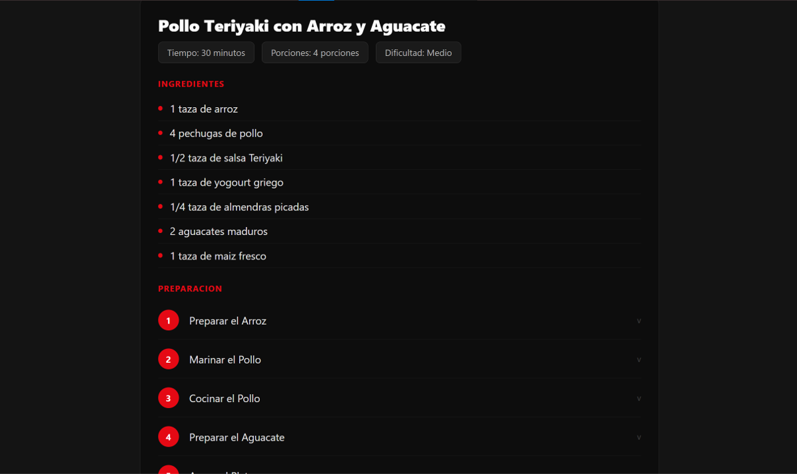
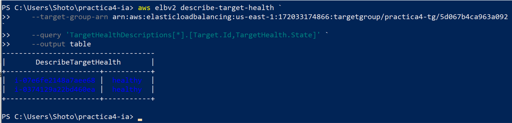
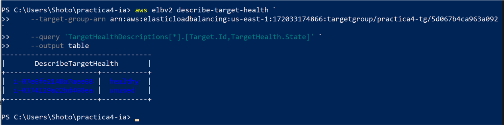
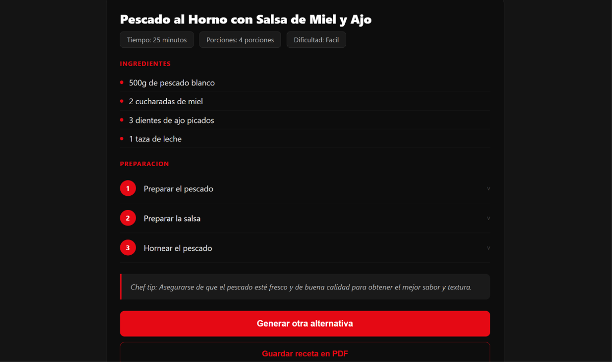

# 🔥 LET HIM COOK — Práctica 4: Multi-Container en AWS

**Computación en la Nube — Universidad Autónoma de Occidente**  
**Docente:** Jhorman A. Villanueva Vivas

**Equipo:** Daniel Fernando Mejia · Ruben Dario Salcedo · Juan Espitia

**URL de la aplicación:** http://practica4-alb-1280823028.us-east-1.elb.amazonaws.com  
**Imagen Docker Hub:** `heyjuanes/chef-ia:latest`

---

## ¿Qué hace la app?

**Let Him Cook** es un asistente de recetas con IA. El usuario escribe los ingredientes que tiene disponibles y la IA genera una receta completa con pasos detallados, tiempo, porciones y consejo de chef. Las recetas se guardan en PostgreSQL y se pueden exportar en PDF.

---

## 1. Infraestructura de red

Se configuró una VPC con dos zonas de disponibilidad (`us-east-1a` y `us-east-1b`), cada una con una subred pública y una subred privada.
```
Internet
    │
    ▼
[Application Load Balancer]
 subredes públicas: 10.0.1.0/24 y 10.0.2.0/24
    │                    │
    ▼                    ▼
[EC2 — us-east-1a]  [EC2 — us-east-1b]
subred privada       subred privada
10.0.3.0/24          10.0.4.0/24
[App + PostgreSQL]   [App]
```

Las subredes privadas tienen salida a internet a través de un **NAT Gateway** ubicado en la subred pública. Esto permite que las instancias descarguen imágenes Docker y consuman APIs externas sin estar expuestas directamente a internet.

---

## 2. Instancias EC2

Se lanzaron **dos instancias EC2 t3.micro** en subredes privadas, una en cada zona de disponibilidad:

| Instancia | Zona | IP Privada | Contenedores |
|---|---|---|---|
| ec2-ia-1a | us-east-1a | 10.0.3.37 | App + PostgreSQL |
| ec2-ia-1b | us-east-1b | 10.0.4.154 | App |

---

## 3. Docker en las instancias

Docker se instaló automáticamente mediante **User Data** al lanzar cada instancia:
```bash
#!/bin/bash
yum update -y
yum install -y docker
systemctl start docker
systemctl enable docker
useradd -m -s /bin/bash appuser
usermod -aG docker appuser
curl -L "https://github.com/docker/compose/releases/latest/download/docker-compose-linux-x86_64" \
  -o /usr/local/bin/docker-compose
chmod +x /usr/local/bin/docker-compose
```

Se creó el usuario `appuser` sin privilegios root. Se agregó al grupo `docker` para que pueda ejecutar contenedores sin usar `sudo`. Todos los contenedores se despliegan bajo la sesión de este usuario.

---

## 4. Aplicación de IA

**Let Him Cook** es un asistente de recetas que usa el modelo **Llama 3.3 70B** via API de Groq. El usuario ingresa ingredientes y la IA genera una receta estructurada en JSON con nombre, tiempo, porciones, ingredientes con cantidades, pasos detallados y consejo de chef.

La imagen del contenedor está publicada en Docker Hub:
```
heyjuanes/chef-ia:latest
```

Los contenedores de la app corren en **ambas instancias** (us-east-1a y us-east-1b).

---

## 5. Acceso desde internet

La aplicación es accesible desde internet a través del **Application Load Balancer**:
```
http://practica4-alb-1280823028.us-east-1.elb.amazonaws.com
```

---

## 6. Base de datos y Docker Compose

Se usa **PostgreSQL 15** en un contenedor en la instancia 1. La instancia 2 se conecta a ella via IP privada (`10.0.3.37`). Se usa Docker Compose para la configuración multi-container.

**Instancia 1 — App + Base de datos:**
```yaml
services:
  app:
    image: heyjuanes/chef-ia:latest
    ports:
      - "8000:8000"
    environment:
      - DB_HOST=db
      - DB_NAME=recetas
      - GROQ_API_KEY=...
    depends_on:
      - db
    restart: always
  db:
    image: postgres:15
    environment:
      - POSTGRES_DB=recetas
      - POSTGRES_USER=postgres
      - POSTGRES_PASSWORD=postgres123
    volumes:
      - pgdata:/var/lib/postgresql/data
    restart: always
volumes:
  pgdata:
```

**Instancia 2 — Solo App (conectada a BD de instancia 1):**
```yaml
services:
  app:
    image: heyjuanes/chef-ia:latest
    ports:
      - "8000:8000"
    environment:
      - DB_HOST=10.0.3.37
      - DB_NAME=recetas
      - GROQ_API_KEY=...
    restart: always
```

---

## 7. Política de mínimos privilegios — Security Groups

Cada Security Group permite únicamente el tráfico estrictamente necesario:

| Security Group | Puerto | Origen | Propósito |
|---|---|---|---|
| alb-loadbalancer | 80 | 0.0.0.0/0 | HTTP desde internet |
| ec2-instancias | 8000 | Solo desde el ALB | Tráfico de la app |
| ec2-instancias | 22 | Solo desde el Bastion | SSH administrativo |
| db-postgres | 5432 | Solo desde las EC2 | Acceso a PostgreSQL |
| bastion-host | 22 | 0.0.0.0/0 | Administración SSH |

Las instancias EC2 **no tienen IP pública**. El único acceso SSH es a través del Bastion Host.

---

## 8. Balanceador de carga

Se configuró un **Application Load Balancer (ALB)** en las subredes públicas. El ALB realiza health checks cada 30 segundos al endpoint `/health`. Si una instancia falla, el tráfico se redirige automáticamente a la otra.

---

## 9. Prueba de Alta Disponibilidad

Se apagó la instancia 2 (us-east-1b) para simular un fallo y verificar que el sistema seguía funcionando.

### Estado inicial — app funcionando con ambas instancias activas


### Ambas instancias healthy en el Load Balancer


### Instancia 2 apagada — ALB detecta la caída y redirige tráfico


### App sigue funcionando desde la instancia 1 (us-east-1a)


El Load Balancer detectó automáticamente que la instancia 2 estaba caída y redirigió todo el tráfico a la instancia 1, sin ninguna interrupción para el usuario final.
## 10. Estructura del repositorio
```
lethimcook/
├── app.py                  # Backend Flask + lógica de IA
├── requirements.txt        # Dependencias Python
├── Dockerfile              # Imagen Docker
├── docker-compose.yml      # Configuración multi-container
├── templates/
│   └── index.html          # Frontend interfaz dark mode
└── README.md               # Este archivo
```

---

## Conclusiones

Este proyecto demostró cómo construir una arquitectura de nube altamente disponible desde cero. La combinación de VPC, subredes privadas, NAT Gateway, Security Groups con mínimos privilegios, Docker Compose y un Application Load Balancer permitió desplegar una aplicación de IA real que tolera fallos de instancia sin interrupción del servicio.
